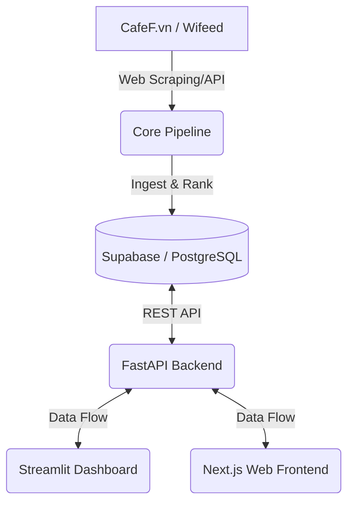

# Vietnam Quantitative Value Stock Screener

A comprehensive quantitative investment system implementing Tobias Carlisle & Wesley Gray's **"Quantitative Value"** framework, specifically adapted for the Vietnam stock market (HOSE, HNX, and UPCOM). 

The system provides a full-stack solution from data ingestion and processing to visualization via multiple dashboard options.

## 🏗️ System Architecture

The project consists of four main components loosely coupled through a Supabase (PostgreSQL) backend:

1.  **Core Pipeline**: Scrapes data from CafeF/Wifeed, cleans financial statements, calculates quant scores, and ranks stocks.
2.  **FastAPI Backend**: A RESTful API that serves processed data and serves as the bridge between the database and frontends.
3.  **Streamlit Dashboard**: A Python-based analytical dashboard for deep dives, charts, and running the pipeline.
4.  **Next.js Web Frontend**: A modern, high-performance web interface for viewing rankings and portfolio data.



## ✨ Key Features

- 📊 **Dual Dashboards** — Choose between a data-heavy Streamlit app or a sleek Next.js web interface.
- 🔄 **Autonomous Pipeline** — Full data lifecycle: Fetch -> Clean -> Score -> Rank -> Persist.
- 🚀 **Momentum Overlay** — Uses 2-12 month return momentum to avoid "falling knives".
- 🛡️ **Safety Screens** — Includes Beneish M-Score (fraud), Altman Z-Score (bankruptcy), and Piotroski F-Score (financial strength).
- 📈 **Visual Analytics** — Heatmaps, Value vs Quality scatter plots, and historical rebalance tracking.

## 🛠️ Setup & Installation

### 1. Backend & Pipeline (Python)

```bash
# Clone the repository
git clone https://github.com/your-username/quant-value-vn.git
cd quant-value-vn

# Create and activate virtual environment
python -m venv venv
source venv/bin/activate  # Linux/macOS
# venv\Scripts\activate   # Windows

# Install dependencies
pip install -r requirements.txt

# Install the package in editable mode
pip install -e .
```

### 2. Configure Environment

1.  Create a project at [supabase.com](https://supabase.com).
2.  Run the SQL schema found in `quant_value_vn/database/schema.sql` in the Supabase SQL Editor.
3.  Copy `.env.example` to `.env` and fill in your Supabase credentials:
    ```bash
    cp .env.example .env
    ```

### 3. Web Frontend (Next.js)

```bash
cd quant_value_vn/web
npm install
```

## 🚀 Usage

### Run the Data Pipeline
Updates the system with the latest financial data and rankings.
```bash
python -m quant_value_vn.pipeline.run_pipeline
```

### Start the FastAPI Backend
Must be running for both the Next.js frontend and Streamlit dashboard.
```bash
# Default port 8000
python -m uvicorn quant_value_vn.app.main:app --reload
```

### Launch the Streamlit Dashboard
Best for analysis and administrative tasks.
```bash
streamlit run quant_value_vn/dashboard/streamlit_app.py
```

### Launch the Next.js Frontend
The modern user interface.
```bash
cd quant_value_vn/web
npm run dev
```

## 📈 Methodology

Following the *Quantitative Value* philosophy:
1.  **Investment Universe**: Filter for liquidity (>5B VND ADV) and market cap (>350B VND).
2.  **The Value Screen**: Slices the universe down to the cheapest 40% based on **EV/EBIT** (Acquirer's Multiple).
3.  **The Quality Screen**: Ranks the cheap subset using ROA, ROC, FCF/Assets, and GM Stability.
4.  **The Safety Screen**: Eliminates manipulators (Beneish M-Score) and distressed firms (Altman Z-Score).
5.  **Momentum Filter**: Excludes stocks with negative 12-month momentum.

## 📜 Disclaimer
This software is for **educational and research purposes only**. It is NOT financial advice. Investing in the stock market involves risk.

## ⚖️ License
MIT License.
