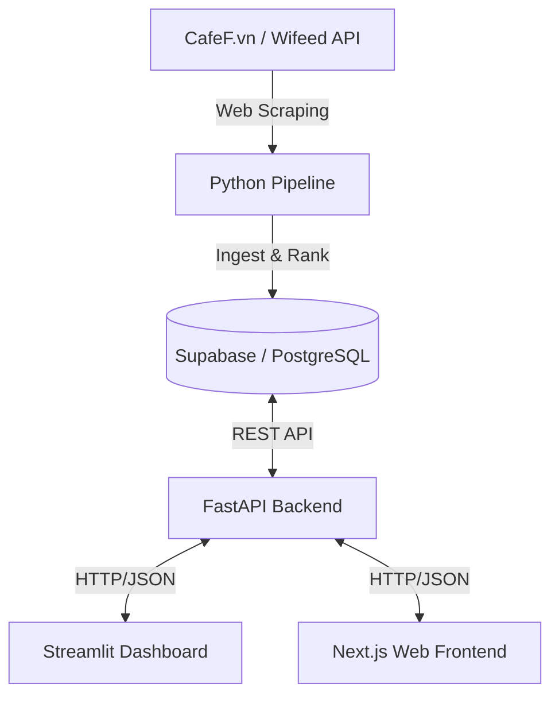

# Vietnam Quantitative Value Stock Screener

A comprehensive quantitative investment system implementing Tobias Carlisle & Wesley Gray's **"Quantitative Value"** framework, specifically adapted for the Vietnam stock market (HOSE, HNX, and UPCOM).

The system provides a full-stack solution from data ingestion and processing to visualization via multiple dashboard options.

## 🏗️ System Architecture

The project consists of four main components loosely coupled through a Supabase (PostgreSQL) backend:



### Components

| Component | Path | Technology | Purpose |
|-----------|------|------------|---------|
| **Data Pipeline** | `quant_value_vn/pipeline/` | Python | Scrapes CafeF.vn, cleans financial data, computes quant scores, ranks stocks |
| **FastAPI Backend** | `quant_value_vn/app/` | FastAPI | RESTful API serving as bridge between database and frontends |
| **Streamlit Dashboard** | `quant_value_vn/dashboard/` | Streamlit + Plotly | Analytical dashboard for deep dives, charts, and running the pipeline |
| **Next.js Frontend** | `quant_value_vn/web/` | Next.js + TypeScript + Tremor | Modern web interface for viewing rankings and portfolio data |

## ✨ Key Features

### Core Screening
- **Dual Dashboards** — Choose between a data-heavy Streamlit app or a sleek Next.js web interface
- **Autonomous Pipeline** — Full data lifecycle: Fetch → Clean → Score → Rank → Persist
- **Momentum Overlay** — Uses 2-12 month return momentum to avoid "falling knives"

### Safety & Quality Screens
- **Beneish M-Score** — Detects potential financial manipulation
- **Altman Z-Score** — Identifies bankruptcy risk
- **Piotroski F-Score** — Measures financial strength
- **Vietnam-Specific Filters** — Auditor qualifications, trading suspensions, market-specific flags

### Analytics & Visualization
- **Value vs Quality Scatter** — Visual mapping of investment opportunities
- **Factor Distribution Charts** — AM, ROA, Gross Profitability, Accruals, M-Score
- **Stock Detail Views** — Per-ticker factor analysis and ranking history
- **Model Portfolio Tracking** — Equal-weight portfolio construction with sector exposure
- **Historical Comparison** — Track ranking changes across screening runs
- **Watchlist Management** — Track holdings and P&L

## 🛠️ Setup & Installation

### Prerequisites

- **Python 3.10+**
- **Node.js 18+** (for Next.js frontend)
- **Supabase account** (free tier works)

### 1. Clone & Python Setup

```bash
# Clone the repository
git clone https://github.com/your-username/quant-value-vn.git
cd quant-value-vn

# Create and activate virtual environment
python -m venv venv
source venv/bin/activate  # Linux/macOS
# venv\Scripts\activate   # Windows

# Install dependencies
pip install -r requirements.txt

# Install the package in editable mode
pip install -e .
```

### 2. Supabase Setup

1. Create a project at [supabase.com](https://supabase.com)
2. Run the SQL schema found in `quant_value_vn/database/schema.sql` in the Supabase SQL Editor
3. Copy `.env.example` to `.env` and fill in your Supabase credentials:

```bash
cp .env.example .env
```

Edit `.env` with your Supabase URL and keys:
```env
SUPABASE_URL=https://your-project.supabase.co
SUPABASE_KEY=your-anon-key
```

### 3. Next.js Frontend Setup (Optional)

The web frontend requires **Node.js 18+**. We recommend using **NVM** for version management.

#### Install NVM (Linux/macOS)
```bash
curl -o- https://raw.githubusercontent.com/nvm-sh/nvm/v0.40.1/install.sh | bash
# Restart terminal or run:
export NVM_DIR="$HOME/.nvm"
[ -s "$NVM_DIR/nvm.sh" ] && \. "$NVM_DIR/nvm.sh"
```

#### Install Node & Dependencies
```bash
cd quant_value_vn/web
nvm install 20
nvm use 20

# Install with legacy-peer-deps to handle Tremor/React conflicts
npm install --legacy-peer-deps
```

## 🚀 Usage

### 1. Run the Data Pipeline

Updates the system with the latest financial data and rankings:

```bash
# Full screening run
python -m quant_value_vn.pipeline.run_pipeline

# Quick mode (30 stocks only)
python -m quant_value_vn.pipeline.run_pipeline --quick

# Custom parameters
python -m quant_value_vn.pipeline.run_pipeline --max-stocks 100 --workers 20
```

**CLI Options:**
- `--max-stocks N` — Maximum stocks to analyze
- `--workers N` — Parallel scraping workers (default: 30)
- `--quick` — Quick mode: only 30 stocks
- `--no-cache` — Skip local cache, force re-scraping
- `--skip-prefilter` — Skip liquidity/sector prefilter (slower)
- `--min-mcap` — Minimum market cap in billion VND
- `--min-adv` — Minimum 20-day avg daily value in billion VND

### 2. Start the FastAPI Backend

Required for both the Next.js frontend and Streamlit dashboard:

```bash
# Default port 8000
python -m uvicorn quant_value_vn.app.main:app --reload

# Custom host/port
python -m uvicorn quant_value_vn.app.main:app --host 0.0.0.0 --port 8000
```

### 3. Launch the Streamlit Dashboard

Best for analysis and administrative tasks:

```bash
streamlit run quant_value_vn/dashboard/streamlit_app.py
```

**Dashboard Pages:**
1. **Dashboard** — KPIs, top 10, Value vs Quality scatter
2. **Screening Results** — Full filterable table
3. **Factor Distribution** — Charts for key factors
4. **Stock Detail** — Per-ticker factor view, ranking history
5. **Model Portfolio** — Top 30 equal-weight, sector exposure
6. **Charts & Analysis** — Scatter, correlation, comparison
7. **Historical Comparison** — Run comparison, rank changes
8. **Watchlist & Portfolio** — Track holdings, P&L
9. **Run Screener** — Launch scan from UI
10. **Settings** — DB info, about

### 4. Launch the Next.js Frontend

The modern user interface:

```bash
cd quant_value_vn/web
npm run dev
```

## 📈 Methodology

Following the *Quantitative Value* philosophy:

### 1. Investment Universe
- Filter for liquidity (>5B VND ADV20)
- Market cap (>350B VND)
- Minimum trading days (50 out of 60)
- Exclude financial sector (banks, insurance, utilities)

### 2. The Value Screen
- Ranks stocks by **Acquirer's Multiple (EV/EBIT)**
- Selects the cheapest 40% of the universe
- Lower multiple = cheaper stock

### 3. The Quality Screen
Ranks the cheap subset using:
- **ROA** (Return on Assets)
- **ROC** (Return on Capital)
- **FCF/Assets** (Free Cash Flow to Assets)
- **GM Stability** (Gross Margin Stability)

### 4. The Safety Screen
- **Beneish M-Score** — Eliminates manipulators (threshold: -1.78)
- **Altman Z-Score** — Removes distressed firms (threshold: 1.81)
- **Piotroski F-Score** — Filters for financial strength (min: 5)

### 5. Momentum Filter
- Excludes stocks with negative 12-2 month momentum
- Avoids "falling knives" — cheap for a reason

### 6. Vietnam-Specific Filters
- Auditor qualification flags
- Trading suspension history
- Market-specific risk indicators

### 7. Final Ranking
- Combined score: Value Rank + Quality Rank
- Top 30 stocks form the model portfolio
- Equal-weight allocation (~3.33% each)

## 📁 Project Structure

```
quant-value-vn/
├── quant_value_vn/
│   ├── app/                    # FastAPI backend
│   │   ├── main.py             # FastAPI application
│   │   ├── routes.py           # API endpoints
│   │   └── services.py         # Business logic
│   ├── dashboard/
│   │   └── streamlit_app.py    # Streamlit dashboard (10 pages)
│   ├── database/
│   │   ├── schema.sql          # Supabase schema
│   │   ├── queries.py          # Database queries
│   │   └── supabase_client.py  # Supabase client
│   ├── pipeline/
│   │   ├── run_pipeline.py     # Main pipeline runner
│   │   ├── ingest.py           # Data scraping (CafeF.vn)
│   │   ├── clean.py            # Data cleaning
│   │   ├── features.py         # Feature computation
│   │   ├── fraud.py            # Beneish M-Score
│   │   ├── quality.py          # Quality factors
│   │   ├── value.py            # Acquirer's Multiple
│   │   ├── momentum.py         # Momentum calculation
│   │   ├── scores.py           # Safety scores (Altman, Piotroski)
│   │   ├── distress.py         # Distress risk (PFD model)
│   │   ├── ranking.py          # Final ranking
│   │   └── vietnam_flags.py    # Vietnam-specific filters
│   ├── tests/                  # Test suite
│   ├── config.py               # Configuration
│   └── web/                    # Next.js frontend
│       ├── src/
│       │   ├── app/            # Next.js 15 App Router
│       │   ├── components/     # React components
│       │   └── services/       # API client
│       └── package.json
├── requirements.txt
├── pyproject.toml
└── .env.example
```

## 🔌 API Endpoints

| Method | Endpoint | Description |
|--------|----------|-------------|
| GET | `/rankings` | Latest top-30 ranked stocks |
| GET | `/rankings/{run_id}` | Results for a specific run |
| GET | `/runs` | List of all screening runs |
| GET | `/stock/{ticker}` | Detail for one ticker |
| GET | `/portfolio` | Latest model portfolio |
| GET | `/watchlist` | Get watchlist |
| POST | `/watchlist` | Add to watchlist |
| DELETE | `/watchlist/{ticker}` | Remove from watchlist |
| POST | `/run` | Trigger a new pipeline run |

## 📊 Database Schema

### Tables

- **`screening_runs`** — Metadata for each screening run (date, total stocks, passed filters)
- **`screening_results`** — Per-stock results for each run (ranks, factors, metrics)
- **`watchlist`** — User watchlist/portfolio with notes and cost basis
- **`portfolio_history`** — Historical tracking of model portfolio composition

## 📜 Disclaimer

This software is for **educational and research purposes only**. It is NOT financial advice. Investing in the stock market involves risk of loss. Past performance does not guarantee future results.

## ⚖️ License

MIT License — See LICENSE file for details.

## 📚 References

- **Quantitative Value** — Tobias Carlisle & Wesley Gray
- **Acquirer's Multiple** — Tobias Carlisle
- **Beneish M-Score** — Messod D. Beneish
- **Altman Z-Score** — Edward Altman
- **Piotroski F-Score** — Joseph Piotroski
